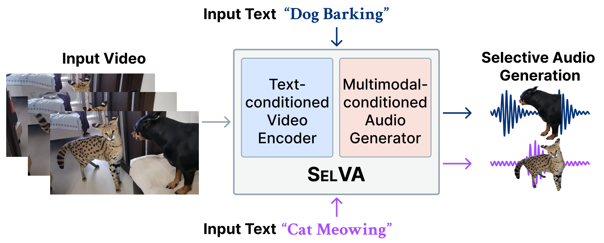

# SelVA: Hear What Matters! Text-conditioned Selective Video-to-Audio Generation

Official PyTorch implementation of "Hear What Matters! Text-conditioned Selective Video-to-Audio Generation". <br/>
arxiv preprint. <br/>
Keywords: Video-to-Audio Generation, Selective Sound Generation, Multimodal Deep Learning.


[]()  [](https://jnwnlee.github.io/selva-demo/)  [](https://huggingface.co/jnwnlee/SelVA)


<table>
  <tr>
    <td></td>
    <td><a href="https://www.youtube.com/watch?v=eUocr6iEyiM">
      
   </a></td>
  </tr>
</table>


## Installation

### Prerequisites

We assume using [miniforge](https://github.com/conda-forge/miniforge) environment.

- Python 3.9+
- PyTorch **2.6.0+** and corresponding torchvision/torchaudio (pick your CUDA version https://pytorch.org/, pip install recommended)

**1. Install prerequisite:**

```bash
pip install torch torchvision torchaudio --index-url https://download.pytorch.org/whl/cu118 --upgrade
conda install ffmpeg=6.1.0 x264 -c conda-forge # optional
```

(Or any other CUDA versions that your GPUs/driver support)

**2. Clone our repository:**

```bash
git clone https://github.com/jnwnlee/SelVA.git
```

**3. Install with pip:**

```bash
cd SelVA
pip install -e .
```

(If you encounter the File "setup.py" not found error, upgrade your pip with ```pip install --upgrade pip```)

**Pretrained models:**

The models will be downloaded automatically when you run the demo script. MD5 checksums are provided in `selva/utils/download_utils.py`. <br/>
The models are also available at https://huggingface.co/jnwnlee/SelVA/tree/main. Place weights of SelVA at `./weights/` folder, and external weights at `./ext_weights` folder. <br/>
Refer to [MODELS.md](docs/MODELS.md) for further details.

## Demo

By default, these scripts use the `small_16k` model. 
In our experiments, inference only takes around 4GB of GPU memory (in 16-bit mode).

```bash
python demo.py --duration=8 --video=<path to video> --prompt "your prompt" 
```

The output (audio in `.flac` format, and video in `.mp4` format) will be saved in `./output`.
See the file for more options.
The default output (and training) duration is 8 seconds. Longer/shorter durations could also work, but a large deviation from the training duration may result in a lower quality.


## Training

See [TRAINING.md](docs/TRAINING.md). (TBA)

## Inference and Evaluation

See [EVAL.md](docs/EVAL.md).

## Training Datasets

SelVA was trained on [VGGSound](https://www.robots.ox.ac.uk/~vgg/data/vggsound/).
Pretrained Synchformer was trained on [AudioSet](https://research.google.com/audioset/).
Pretrained MMAudio was trained on several datasets, including [AudioSet](https://research.google.com/audioset/), [Freesound](https://github.com/LAION-AI/audio-dataset/blob/main/laion-audio-630k/README.md), [VGGSound](https://www.robots.ox.ac.uk/~vgg/data/vggsound/), [AudioCaps](https://audiocaps.github.io/), and [WavCaps](https://github.com/XinhaoMei/WavCaps). 
These datasets are subject to specific licenses, which can be accessed on their respective websites. Please follow the corresponding licenses and guidelines at usage.


## Updates

- [ ] add training and example bench.
- [ ] add model variants.
- [ ] add VGG-MonoAudio.


## Citation

```bibtex
@article{selva,
  title={Hear What Matters! Text-conditioned Selective Video-to-Audio Generation},
  author={Lee, Junwon and Nam, Juhan and Lee, Jiyoung},
  journal={arXiv preprint arXiv:2512.02650},
  year={2025}
}
```

## Relevant Repositories

- [av-benchmark](https://github.com/hkchengrex/av-benchmark) for benchmarking results.
- [kadtk](https://github.com/YoonjinXD/kadtk) for KAD calculation.

## Acknowledgement

We sincerely thank the authors for open-sourcing the following repos:
- [MMAudio](https://github.com/hkchengrex/MMAudio)
- [Synchformer](https://github.com/v-iashin/Synchformer) 
- [Make-An-Audio 2](https://github.com/bytedance/Make-An-Audio-2) for the 16kHz BigVGAN pretrained model and the VAE architecture
- [BigVGAN](https://github.com/NVIDIA/BigVGAN)
- [EDM2](https://github.com/NVlabs/edm2) for the magnitude-preserving network architecture
