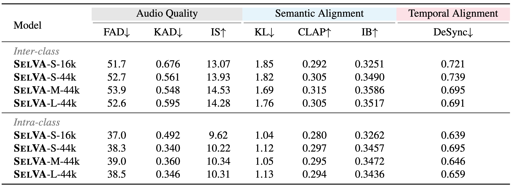

# Pretrained models

The models will be downloaded automatically when you run the demo script. MD5 checksums are provided in `selva/utils/download_utils.py`.
The models are also available at https://huggingface.co/jnwnlee/SelVA/tree/main.

| Model    | Download link | File size | Params |
| -------- | ------- | ------- | ------- |
| text-conditioned video encoder, 5 \[sup\] | <a href="https://huggingface.co/jnwnlee/SelVA/resolve/main/weights/video_enc_sup_5.pth" download="mmaudio_small_44k.pth">video_enc_sup_5.pth</a> | 515M | 135M |
| generator, small 16kHz | <a href="https://huggingface.co/jnwnlee/SelVA/resolve/main/weights/generator_small_16k_sup_5.pth" download="generator_small_16k_sup_5.pth">generator_small_16k_sup_5.pth</a> | 601M | 157M |
| generator, small 44kHz | <a href="https://huggingface.co/jnwnlee/SelVA/resolve/main/weights/generator_small_44k_sup_5.pth" download="generator_small_44k_sup_5.pth">generator_small_44k_sup_5.pth</a> | 601M | 157M |
| generator, medium 44kHz | <a href="https://huggingface.co/jnwnlee/SelVA/resolve/main/weights/generator_medium_44k_sup_5.pth" download="generator_medium_44k_sup_5.pth">generator_medium_44k_sup_5.pth</a> | 2.4G | 621M |
| generator, large 44kHz | <a href="https://huggingface.co/jnwnlee/SelVA/resolve/main/weights/generator_large_44k_sup_5.pth" download="generator_large_44k_sup_5.pth">generator_large_44k_sup_5.pth</a> | 3.9G | 1.03B |
| 16kHz VAE | <a href="https://huggingface.co/jnwnlee/SelVA/resolve/main/ext_weights/v1-16.pth">v1-16.pth</a> | 687M | - |
| 16kHz BigVGAN vocoder (from Make-An-Audio 2) |<a href="https://huggingface.co/jnwnlee/SelVA/resolve/main/ext_weights/best_netG.pt">best_netG.pt</a> | 449M | - |
| 44.1kHz VAE |<a href="https://huggingface.co/jnwnlee/SelVA/resolve/main/ext_weights/v1-44.pth">v1-44.pth</a> | 1.22G | - |
| Synchformer visual encoder |<a href="https://huggingface.co/jnwnlee/SelVA/resolve/main/ext_weights/synchformer_state_dict.pth">synchformer_state_dict.pth</a> | 950M | - |



To run the model, you need four components: text feature extractor (FLAN-T5 will be downloaded automatically), text-conditioned video encoder, an flow-based audio generator, a VAE, and a vocoder. VAEs and vocoders are specific to the sampling rate (16kHz or 44.1kHz).
The 44.1kHz vocoder will be downloaded automatically.

The expected directory structure (full):

```bash
SelVA
├── weights/
│   ├── video_enc_sup_5.pth
│   └── generator_small_16k_sup_5.pth
└── ext_weights/
│   ├── synchformer_state_dict.pth
│   ├── best_netG.pt
│   ├── v1-16.pth
│   └── v1-44.pth
└── ...
```

The expected directory structure (minimal, for the recommended model only):

```bash
SelVA
├── weights/
│   ├── video_enc_sup_5.pth # text-conditioned video encoder
│   └── generator_small_16k_sup_5.pth # v2a generator
└── ext_weights/
│   ├── best_netG.pt # BigVGAN vocoder
│   └── v1-16.pth # vae 16kHz
└── ...
```
